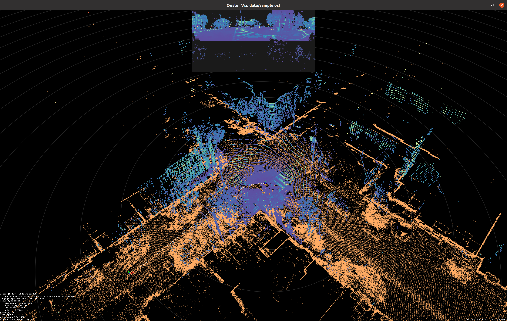

.. _ouster-cli-mapping:

Using the CLI
=============

Installation
------------

The Ouster CLI mapping functionality is a part of the Ouster SDK Python
package.

To install the Ouster SDK with the mapping capabilities:

.. tab-set::
   :sync-group: os-commands

   .. tab-item:: Linux/macOS
      :sync: unix

      .. code::

        $ python3 install ouster-sdk
   
   .. tab-item:: Windows x64
      :sync: windows

      .. code::

        PS >  py -3 install ouster-sdk

Mapping Tools
-------------

After installing the Ouster SDK and mapping dependencies, you can explore various mapping tools
using a connected Ouster sensor or a PCAP/OSF file.

To explore and configure the parameters of the SLAM algorithm, you can use the ``--help`` flag
to view the available options.

.. literalinclude:: ../../../python/tests/documentation/test_cli_commands.py
   :language: bash
   :start-after: [doc-slam-help-begin]
   :end-before: [doc-slam-help-end]
   :dedent: 0

The ``slam`` command can be combined with either or both the ``save`` and ``viz`` commands.
You can further explore each command in detail by accessing their respective submenus
using the ``--help`` flag.

.. literalinclude:: ../../../python/tests/documentation/test_cli_commands.py
   :language: bash
   :start-after: [doc-slam-save-help-begin]
   :end-before: [doc-slam-save-help-end]
   :dedent: 0

.. literalinclude:: ../../../python/tests/documentation/test_cli_commands.py
   :language: bash
   :start-after: [doc-slam-viz-help-begin]
   :end-before: [doc-slam-viz-help-end]
   :dedent: 0

SLAM Command
------------

Simultaneous Localization and Mapping (SLAM) is a technique that enables a system to construct
a map of its surroundings while simultaneously determining its own position on that map.

We use the slam algorithm to determine the lidar movement trajectory, correct motion
distortion and reconstruct a detailed and precise point cloud map.

Connect to a sensor or use a PCAP/OSF file :ref:`Download Sample PCAP File <sample-data-download>`

.. note::

        Connecting to an Ouster sensor is covered in the :ref:`Using an Ouster Sensor <using-ouster-sensor>`
        section of the Ouster Sensor Documentation.

Then execute the following command.

.. literalinclude:: ../../../python/tests/documentation/test_cli_commands.py
   :language: bash
   :start-after: [doc-slamviz-begin]
   :end-before: [doc-slamviz-end]
   :dedent: 0

.. note::

        Please replace <SOURCE_URL> with the corresponding hostname or IP of your sensor, and replace
        <FILENAME> with the actual file path and name of the PCAP/OSF file. Similarly, make the
        necessary substitutions in the subsequent commands.

.. note::
        
        Saving frames will fail if they are missing packet timestamps. Try adding the `--ts lidar` option to the `save` command invocation in such cases, or use the `-c` flag to continue attempting to save data after encountering a save error.

.. _ouster-cli-mapping-save:

Save Command
------------

The ``save`` command stores the lidar data and the lidar movement trajectory into a OSF file by
specifying a filename with a .osf extension. This OSF file will be used for accumulated point
cloud generation and the other post-process tools we offer in the future.

.. literalinclude:: ../../../python/tests/documentation/test_cli_commands.py
   :language: bash
   :start-after: [doc-slam-save-begin]
   :end-before: [doc-slam-save-end]
   :dedent: 0
   

The ``save`` command can also be used to generate an accumulated point cloud map using a
SLAM-generated OSF file in LAS (.las), PLY (.ply), or PCD (.pcd) format.
The output format depends on the extension of the output filename.
For example, to convert the OSF file we generated using the ``slam`` command to PLY format,
we can simply use the following:

.. literalinclude:: ../../../python/tests/documentation/test_cli_commands.py
   :language: bash
   :start-after: [doc-slam-saveply-begin]
   :end-before: [doc-slam-saveply-end]
   :dedent: 0

However, please be aware that this combined process can be resource-intensive.
We recommend using this approach with a PCAP/OSF file rather than with a live sensor to avoid
SLAM performance degradation.

The accumulated point cloud data is automatically split and downsampled into multiple files to
prevent exporting a huge size file. The terminal will display details, and you will see the
following printout for each output file:

.. code:: bash

        Output file: output-000.ply
        Point Cloud status info
        3932160 points accumulated during this period,
        1629212 down sampling points are removed [41.43 %],
        2213506 out range points are removed [56.29 %],
        89442 points are saved [2.27 %]

Use the ``--help`` flag for more information such as selecting different fields as values,
and changing the point cloud downsampling scale etc.

To filter out the point cloud, you can using the ``clip`` command. Converting the SLAM output OSF
file to a PLY file and keep only the point within 20 to 80 meters range you can run:

.. literalinclude:: ../../../python/tests/documentation/test_cli_commands.py
   :language: bash
   :start-after: [doc-clipply-begin]
   :end-before: [doc-clipply-end]
   :dedent: 0
   
More details about the clip command usage can be found in the :ref:`Clip Command <ouster-cli-clip>`

You can use an open source software `CloudCompare`_ to import and view the generated point cloud
data files.

Multi sensor SLAM support and Timing synchronization
^^^^^^^^^^^^^^^^^^^^^^^^^^^^^^^^^^^^^^^^^^^^^^^^^^^^

The accuracy of multi-sensor SLAM relies on two key prerequisites:

- Precise sensor extrinsics (rigid-body calibration between sensors)
- Tightly synchronized timestamps (via PTP or equivalent)

When both are in place, the SLAM algorithm can fuse point clouds with minimal drift and maximum consistency. 

In cases where sensors may not be time-synchronized or column timestamps present within frames are not guaranteed to be monotonically increasing,
SDK applies an estimated clock offset. This might result in a degradation of map quality. 

In those cases, the SDK’s software-based timing correction serves as a patch, but it cannot fully recover the precision of a properly synchronized setup.

Localize Command
----------------

After you export a map from SLAM (PLY or PCD), use ``ouster-cli`` to localize live or recorded lidar
against that map. Command-line usage, initial pose, tuning flags, and visualizer options for the
reference map are documented in :doc:`../localization/using-cli`.

.. literalinclude:: ../../../python/tests/documentation/test_cli_commands.py
   :language: bash
   :start-after: [doc-localize-begin]
   :end-before: [doc-localize-end]
   :dedent: 0

.. code:: bash

        ouster-cli source {SOURCE_URL} localize map.ply viz

Once this command is invoked the viz will load the given map and display it in the background (flattened
by default) while simultaneously streaming the lidar data from the ``SOURCE_URL`` and updating the
position of the sensor relative to the map origin as show in the image below:

.. note::

        Currently PLY and PCD are the supported formats for the localization map.

This above example works fine when the input source begins from the same place as the origin of the map,
however, in many situations this isn't the case. In the case of wanting to start from a different
starting point than the map origin, the user could do that using the following:

.. literalinclude:: ../../../python/tests/documentation/test_cli_commands.py
   :language: bash
   :start-after: [doc-initpose-begin]
   :end-before: [doc-initpose-end]
   :dedent: 0

This would set the initial pose of the input source with respect to the map origin, where PX,PY,PZ
represent the position and R,P,Y represent orientation in Euler angles (roll, pitch, yaw)
specified in degrees.

As part of the localization feature the ``viz`` command was extended to give control the visuals of the
localization map. All these options start with the ``--global-map`` prefix. For example, it is possible
to show the localization map in its 3D form without flattening by passing the option
``--global-map-flatten False`` to the ``viz`` command. With this the command becomes like this:

.. literalinclude:: ../../../python/tests/documentation/test_cli_commands.py
   :language: bash
   :start-after: [doc-flatmap-begin]
   :end-before: [doc-flatmap-end]
   :dedent: 0

To see the full list of available options to modify the map visuals check the ``viz`` help menu.

For the Python/C++ API, configuration reference, and visualization topics, see
:doc:`../localization/index`.

.. _CloudCompare: https://www.cloudcompare.org/

