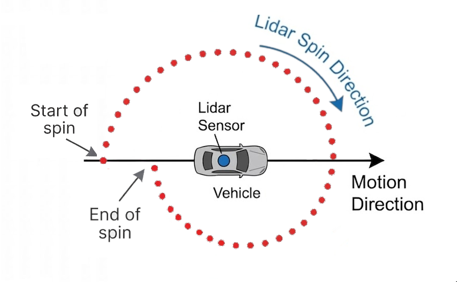
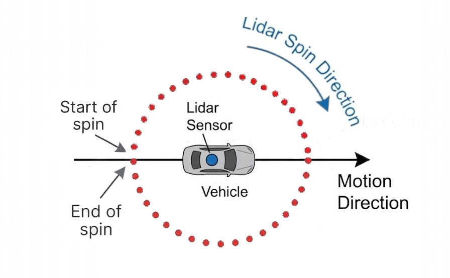
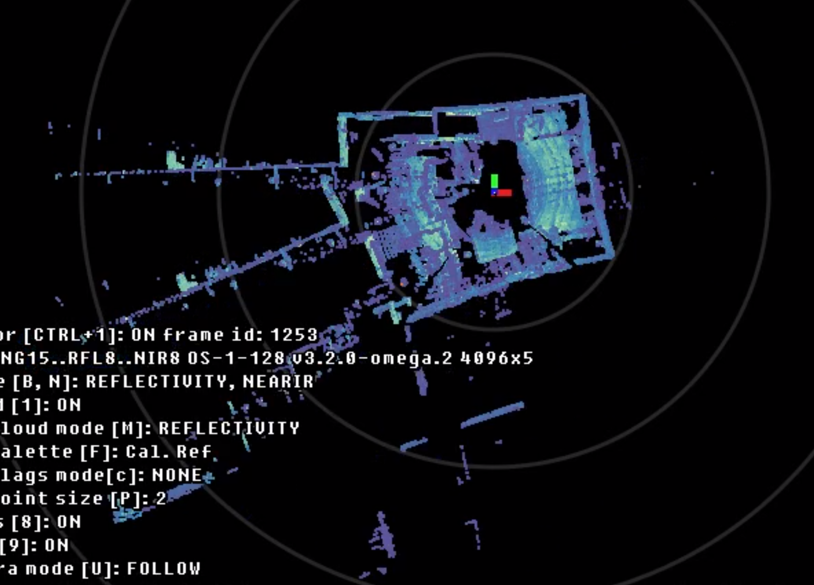

Motion Compensation
===================

Motion compensation (often referred to as "deskewing") is a technique used to correct for distortions
in the pointcloud when collecting Lidar data while the sensor is in motion. Because mechanical spinning
Lidar sensors like Ouster's OS1-64 do not capture the entire 360-degree environment at the same
instant in time, thus distortions manifest during both the translation (linear movement) and rotation
(turning) of the sensor.

When a sensor is mounted to a moving vehicle, the physical position of the sensor changes between the
time the frame starts and the time it finishes (typically 100 milliseconds for a 10 Hz spin rate). The
collected lidar data will have a distortion effect similar to the one shown in the following image:

If raw, distorted Lidar data is fed into a SLAM (Simultaneous Localization and Mapping) algorithm
without correction, it severely degrades the frame matching process. The algorithm will struggle to
align consecutive frames, resulting in "ghosting," duplicated geometry, and a degraded final map.

A motion compensated lidar data of the previous example will ideally similar to the following image:

While translation stretches the data, rotational distortion can be even more destructive. If the vehicle
makes a sharp turn while the sensor is spinning, straight lines (like walls or building facades) will
appear curved, warped, or split as shown in the following image:

Methods of Compensation
-----------------------
To fix these distortions, we must estimate where the sensor was at the specific timestamp at which each
laser pulse was fired.

1. The Constant Velocity Motion Model
~~~~~~~~~~~~~~~~~~~~~~~~~~~~~~~~~~~~~
A common baseline approach is the constant velocity model. This model assumes that the sensor is moving
with a constant velocity between subsequent poses and interpolates the sensor's position and heading over
time.

**Pros**:
- Works well for predictable motions (no sudden changes in velocity or direction).
- Does not require additional hardware (IMU).
   
**Cons**: Fails completely during erratic movement such as sudden braking, hitting a pothole, or making
sharp turns.

2. IMU-Aided Motion Compensation
~~~~~~~~~~~~~~~~~~~~~~~~~~~~~~~~
To overcome the limitations of the constant velocity model, an Inertial Measurement Unit (IMU) can be
used to detect the motion direction and speed and can be used to aid with the motion compensation
process. An IMU measures linear acceleration (via accelerometers) and angular velocity (via gyroscopes)
at much higher frequencies than the spin rate of a Lidar sensor (typically in the range of 100 Hz and
1000 Hz). This provides inputs to the motion compensation process which greatly improves its accuracy.

Ouster FW 3.2 and SDK 0.16
--------------------------
Ouster 3.2 firmware improved the current integration and outcome of the built-in IMU providing a higher
frequency of imu samples that is readily time-synced with the Lidar data.

The Ouster SDK 0.16 SLAM and Localization modules mathematically integrate the IMU data (linear
acceleration and angular velocity) over the period of the LidarFrame to provide a precise pose estimate
(position and orientation) for every timestamp in the LidarFrame.

The Ouster SDK expose these motion compensation capabilities through both the CLI and Python API.

This offers an improved frame registration process and a more accurate map.

Using Motion Compensation via CLI
----------------------------------

The Ouster SDK CLI provides commands to apply motion compensation to recorded data.

To specify the motion compensation method during slam use the ``--deskew-method`` option:

.. code-block:: bash

    ouster-cli source $SOURCE_URL slam --deskew-method $DESKEW_METHOD viz

The ``--deskew-method`` option has one of the following:
  - ``"auto"``: [default] Automatically select the method based on the sensor firmware version.
  - ``"constant_velocity"``: Use the constant velocity motion model.
  - ``"imu_deskew"``: Use the IMU-aided motion compensation (requires FW 3.2).
  - ``"none"``: Disable motion compensation.

To learn about how to use :doc:`Motion Compensation via API  </features/mapping/using-the-api>` refer to the next section.
