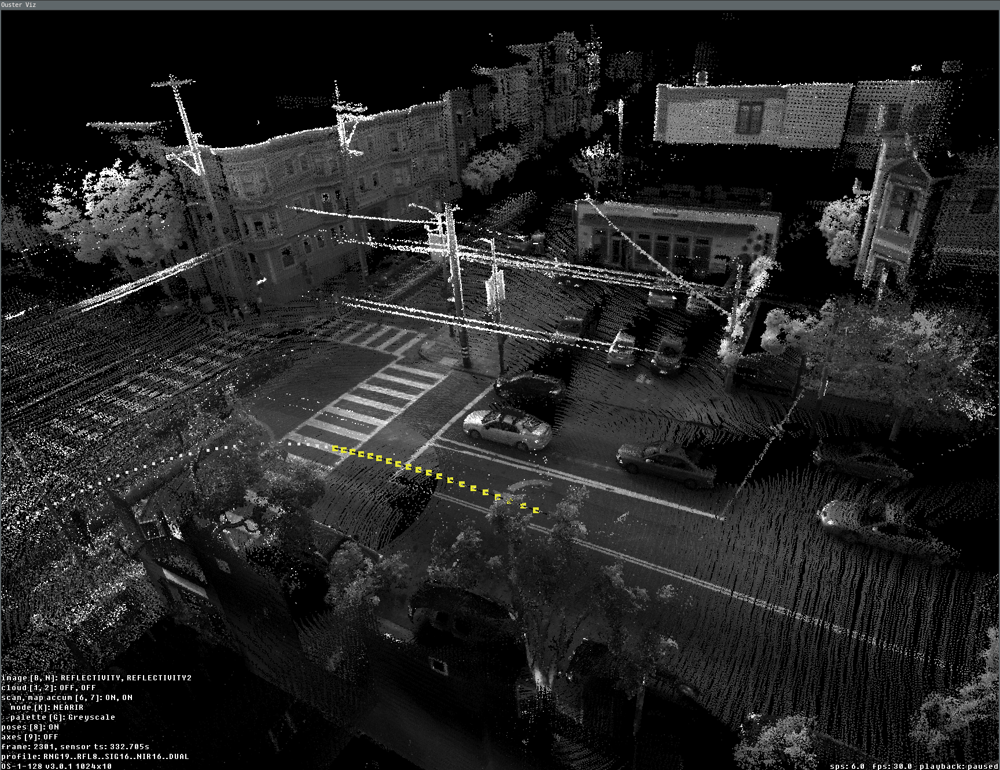
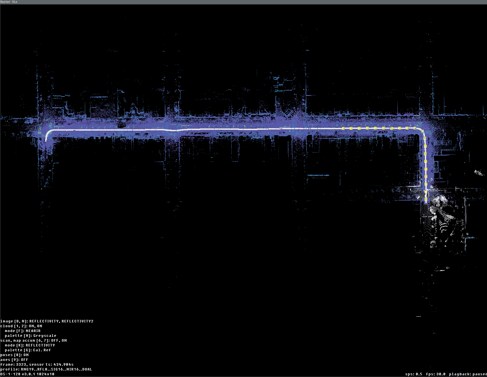
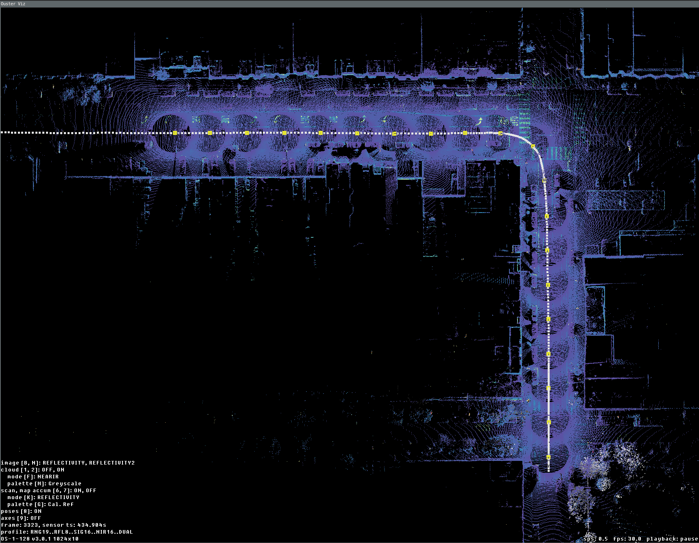
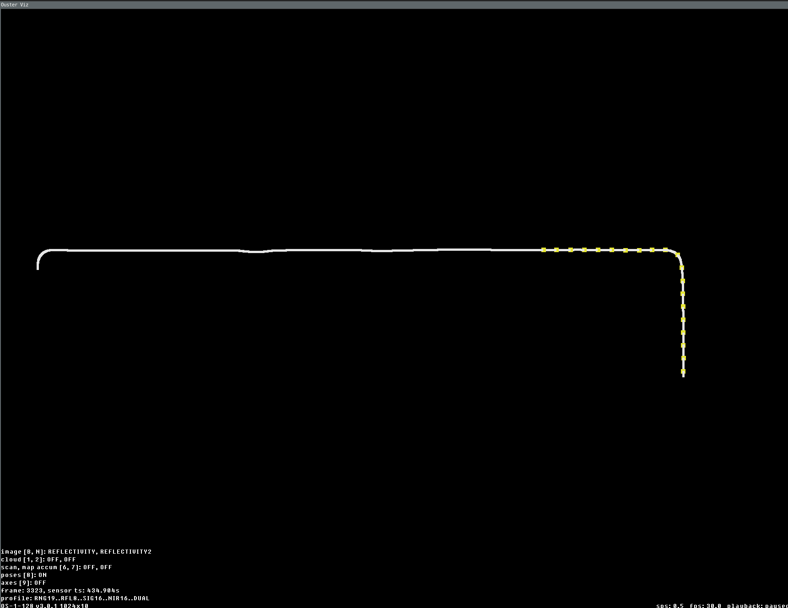

.. _viz-frames-accum:

Using the Visualizer
====================

It's easier than ever to use "map" or "frame"
accumulation to visualize lidar frames that contain pose information. The
default visualizer, ``SimpleViz``, present in both ``ouster-cli`` and Ouster
SDK's Python API support these accumulation modes out of the box.

Furthermore, when poses are not present in the ``LidarFrame`` accumulation may
still be useful to view the accumulated *N* frames from the live
sensor/recording and reveal the accuracy/repeatability of the data.

Slam Viz command
^^^^^^^^^^^^^^^^

The ``viz`` command enables visualizing the accumulated point cloud generation during the
SLAM process. By default, the viz operates in looping mode, meaning the visualization will
continuously replay the source file.

.. code:: bash

        ouster-cli source <SENSOR_HOSTNAME> / <FILENAME> slam viz

When combining the ``viz`` and ``save`` commands, the saving process will automatically terminate
after the first iteration, and then the SLAM process restarts for each subsequent lidar frame iteration.
To end the SLAM and visualization processes after the save operation completes, you can use ``ctrl + c``.
Alternatively, you can add ``-e exit`` to the ``viz`` command to terminate the process after a
complete iteration.

.. code:: bash

        ouster-cli source <SENSOR_HOSTNAME> / <FILENAME> slam viz -e exit save sample.osf

**Accumulation**: The viz command supports several options for creating visually-pleasing maps by accumulating data from
lidar frames that contain pose information. The following sections describe the options and provide usage examples.

Available view modes
^^^^^^^^^^^^^^^^^^^^

There are three view modes of accumulation implemented in the default
visualizer that may be enabled/disabled depending on its parameters and the data
that is passed through it:

.. list-table::
   :header-rows: 1
   :widths: 25 55 20

   * - Mode
     - Description
     - Toggle key
   * - **poses**
     - Displays all frame poses in a trajectory/path view when pose data is available in the frames.
     - ``8``
   * - **map accumulation**
     - Overall map view with select ratio of random points from every frame; works with or without pose data.
     - ``7``
   * - **frame accumulation**
     - Accumulates *N* key-frame frames according to the configured parameters; works with or without pose data.
     - ``6``

CLI ``viz`` accumulation options
^^^^^^^^^^^^^^^^^^^^^^^^^^^^^^^^^

* **frame accumulation options**

  * ``--accum-num INTEGER`` Accumulate up to this number of past frames for
    visualization. Use <= 0 for unlimited. Defaults to 100 if ``--accum-every`` or
    ``--accum-every-m`` is set.
  * ``--accum-every INTEGER`` Add a new frame to the accumulator for every specified number
    of frames as an argument in this option.
  * ``--accum-every-m FLOAT`` Add a new frame to the accumulator after specified number of 
    meters of travel.

* **map accumulation options**

  * ``--map`` If set, add random points from every frame into an overall map for
    visualization. Enabled if either ``--map-ratio`` or ``--map-size`` are set.
  * ``--map-ratio FLOAT`` Fraction of random points in every frame to add to
    overall map (0, 1]. [default: 0.01]
  * ``--map-size INTEGER`` Maximum number of points in overall map before
    discarding. [default: 1500000]

Key bindings
^^^^^^^^^^^^

The following key shortcuts apply to accumulation options while running Ouster CLI's ``viz`` command.

.. list-table::
   :header-rows: 1
   :widths: 12 18 70

   * - Key
     - Accumulation Mode
     - What it does
   * - ``6``
     - Frame
     - Toggle frames accumulation view mode.
   * - ``7``
     - Map
     - Toggle overall map view mode.
   * - ``8``
     - Frame & Map
     - Toggle poses/trajectory view mode.
   * - ``k / K``
     - Frame & Map
     - Cycle point cloud coloring mode of accumulated clouds or map.
   * - ``g / G``
     - Frame & Map
     - Cycle point cloud color palette of accumulated clouds or map.
   * - ``j / J``
     - Frame & Map
     - Increase/decrease point size of accumulated clouds or map.

Dense accumulated clouds view (with every point of a frame)
^^^^^^^^^^^^^^^^^^^^^^^^^^^^^^^^^^^^^^^^^^^^^^^^^^^^^^^^^^^

To obtain the densest view use the ``--accum-num N --accum-every 1`` parameters where ``N`` is the
number of clouds to accumulate (``N`` up to 100 is generally small enough to avoid slowing down
the viz interface.)

The following example computes poses for each frame using the ``slam`` command and creates a dense
map using the ``viz --accum-num 20`` to accumulate the points from 20 frames. Finally, the ``save`` command writes the
frames with their computed trajectories to an OSF file. (Note - accumulation is a visualization feature only. The
accumulated data is not saved to the file.)::

   ouster-cli source <SENSOR_HOSTNAME> / <FILENAME> slam viz --accum-num 20 save sample.osf

and the dense accumulated clouds result:

   Dense view of 20 accumulated frames during the ``slam viz`` run

Overall map view (with poses)
^^^^^^^^^^^^^^^^^^^^^^^^^^^^^

One of the main tasks we frequently need is a preview of the overall map. We can test this by using
the SLAM-generated OSF file, which was created with the above command and contains the
SLAM trajectory in ``LidarFrame.body_to_world``. If you are using a SLAM-generated OSF, you can directly use
viz with frame accumulator feature without appending the ``slam`` option.

.. code:: bash

   ouster-cli source ouster_sensor_recording.osf viz --accum-num 20 \
        --accum-every-m 10.5 --map -r 3 -e stop

Here is a preview example of the overall map generated from the accumulated frame results.
By utilizing the '-e stop' option, the visualizer stops once the replay process finishes,
displaying the preview of the lidar trajectory:

  

   Data fully replayed with map and accum enabled (last current frame is displayed here in gray
   palette)

   Data fully replayed with view only last 20 frames accumulated every 10.5 meters

   Data fully replayed with view of only trajectory (yellow knobs are 20 accumulated key frames
   positions)

Vizualization using Python API
^^^^^^^^^^^^^^^^^^^^^^^^^^^^^^

The following examples show how to compute SLAM poses and visualize frame accumulation modes directly from Python.

.. rubric:: **SimpleViz with frame accumulation**

.. literalinclude:: _snippets/python/simpleviz_frames_accum.py
   :language: python
   :start-after: [doc-stag-slam-simpleviz]
   :end-before: [doc-etag-slam-simpleviz]
   :class: doc-snippet
   :caption: `View on GitHub <|github-src|docs/features/mapping/_snippets/python/simpleviz_frames_accum.py>`__

.. rubric:: **LidarFrameViz with accumulators config**

.. literalinclude:: _snippets/python/lidarframeviz_frames_accum.py
   :language: python
   :start-after: [doc-stag-slam-lsviz]
   :end-before: [doc-etag-slam-lsviz]
   :class: doc-snippet
   :caption: `View on GitHub <|github-src|docs/features/mapping/_snippets/python/lidarframeviz_frames_accum.py>`__