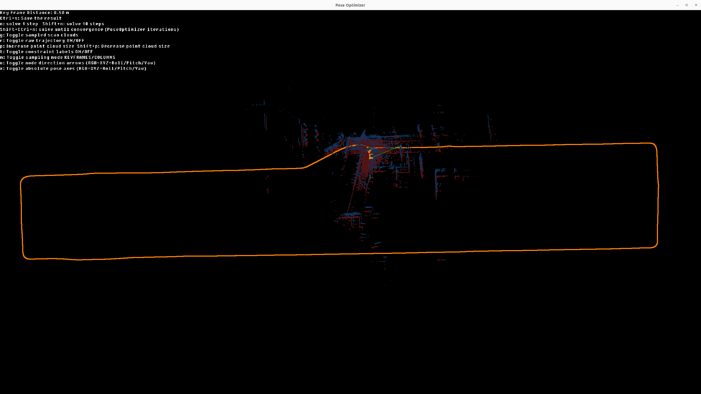
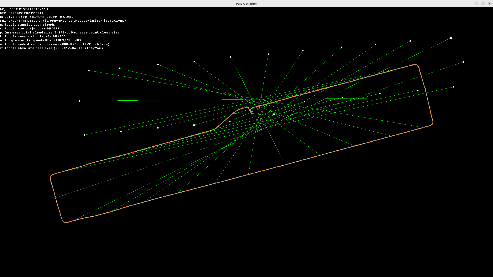
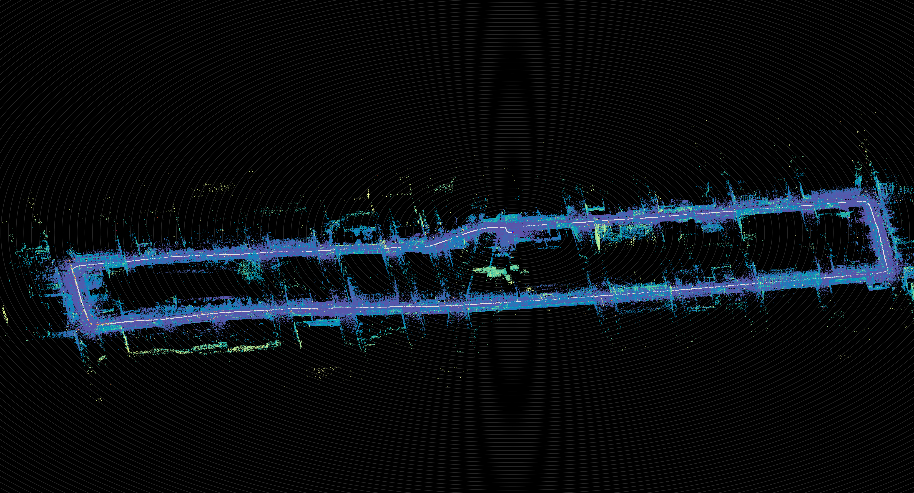

.. _ouster-cli-pose-optimizer:

Using the CLI
=============

This guide walks through common ``ouster-cli`` commands for running the Pose Optimizer end-to-end with the bundled ``loop.osf`` sample and an optional ``constraints.json`` file. Start with ``ouster-cli source loop.osf pose_optimize --help`` to see the full usage text for the ``pose_optimize`` subcommand, including required arguments and optional flags.

.. literalinclude:: ../../../python/tests/documentation/test_cli_commands.py
   :language: bash
   :dedent: 0
   :start-after: [doc-po-cli-help-begin]
   :end-before: [doc-po-cli-help-end]

Pose Optimizer
--------------

To run the Pose Optimizer with a specific set of constraints, use a SLAM-processed OSF file and a constraint JSON file passed via ``--config``:

.. literalinclude:: ../../../python/tests/documentation/test_cli_commands.py
   :language: bash
   :dedent: 0
   :start-after: [doc-po-cli-run-begin]
   :end-before: [doc-po-cli-run-end]

The above command applies the constraints defined in ``constraints.json``, runs optimization, and outputs the refined trajectory in ``optimized_loop.osf``.

Run with Viz
~~~~~~~~~~~~

You can also visualize the applied constraints and the refinement of the trajectory during the optimization process:

.. literalinclude:: ../../../python/tests/documentation/test_cli_commands.py
   :language: bash
   :dedent: 0
   :start-after: [doc-po-cli-viz-begin]
   :end-before: [doc-po-cli-viz-end]

Pose Optimizer Viz displaying the bundled ``loop.osf`` sample with the Pose Optimizer getting-started constraints.

Automatic GPS Constraints
~~~~~~~~~~~~~~~~~~~~~~~~~

If your OSF includes GPS data, you can let the CLI generate absolute pose
constraints automatically with ``--auto-gps``. Auto-generated GPS constraints can be used on
their own or combined with a manual constraints file. If you combine
``--auto-gps`` with ``--config``, remove any ``ABSOLUTE_POSE`` constraints from
the JSON to avoid conflicts with the generated GPS constraints.

.. literalinclude:: ../../../python/tests/documentation/test_cli_commands.py
   :language: bash
   :dedent: 0
   :start-after: [doc-po-cli-auto-gps-begin]
   :end-before: [doc-po-cli-auto-gps-end]

Automatic Loop Closures
~~~~~~~~~~~~~~~~~~~~~~~

Use ``--auto-loop`` to detect loop-closure pose constraints from the current
trajectory. Under the hood the CLI calls
``PoseOptimizer.add_relative_loop_constraints()`` and exposes the same tuning
parameters through the following flags:

.. list-table::
   :header-rows: 1
   :widths: 30 15 55

   * - Flag
     - Default
     - Description
   * - ``--loop-min-distance-m``
     - 50.0
     - Minimum traveled distance (meters) between successive loop-closure additions.
   * - ``--loop-cell-size-m``
     - auto
     - Spatial hash grid cell size (meters). Auto-calculated from the trajectory span if omitted.
   * - ``--icp-threshold``
     - 0.6 (batch) / 0.0 (viz)
     - Minimum ICP confidence score in ``[0, 1]`` to keep an auto-loop pair. In viz mode the default is ``0.0`` so every candidate is shown for manual review.

.. literalinclude:: ../../../python/tests/documentation/test_cli_commands.py
   :language: bash
   :dedent: 0
   :start-after: [doc-po-cli-auto-loop-begin]
   :end-before: [doc-po-cli-auto-loop-end]

Combined GPS + Loop Workflow
~~~~~~~~~~~~~~~~~~~~~~~~~~~~

When ``--auto-gps`` and ``--auto-loop`` are both passed in batch mode, the CLI
first adds GPS constraints and solves once before running loop detection. That
gives loop search a better starting trajectory, then the optimizer solves again
with the added loop closures.

With ``--viz``, the GPS constraints are still added before the viewer opens,
but loop detection is deferred. Press ``L`` in the visualizer to generate loop
closures from the current trajectory after inspecting or adjusting the initial
alignment. The initial GPS alignment transform is applied to both the optimized
trajectory and the raw (pre-optimization) overlay so they stay visually
registered.

.. literalinclude:: ../../../python/tests/documentation/test_cli_commands.py
   :language: bash
   :dedent: 0
   :start-after: [doc-po-cli-auto-gps-loop-begin]
   :end-before: [doc-po-cli-auto-gps-loop-end]

Visualization Point Cloud with Refined Trajectory
-------------------------------------------------

When using ``--viz``, saving is a separate step: press **Ctrl + S** in the viewer to write the optimized result to the mentioned
filename such as ``optimized_loop.osf``.

Once you have an output OSF, you can use the ``viz`` command to visualize and validate
the point cloud with the refined trajectory:

.. literalinclude:: ../../../python/tests/documentation/test_cli_commands.py
   :language: bash
   :dedent: 0
   :start-after: [doc-po-cli-map-begin]
   :end-before: [doc-po-cli-map-end]

   Point Cloud with refined trajectory.

.. _Sample Data: https://studio.ouster.com/share/T29BEI2EIL55T648
