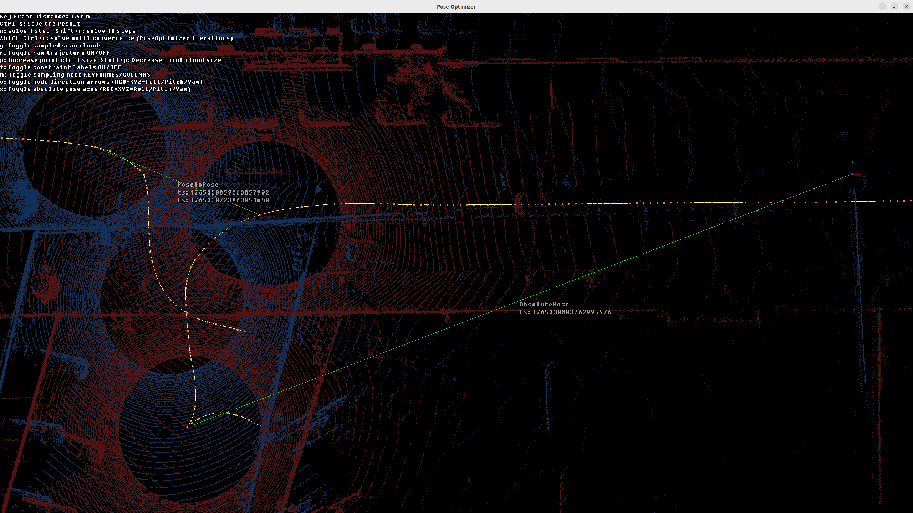

.. _pose-optimizer-visualization:

====================
Using the vizualizer
====================

Pose Optimizer visualization is delivered solely through the Python
``PoseOptimizerViz`` API and there is no standalone C++ visualizer for now.

Ouster-CLI Usage
================
``ouster-cli`` simply wraps the same Python viewer under the hood. The
``pose_optimize`` subcommand includes a ``--viz`` flag that launches the GUI
while running the optimizer:

.. code-block:: bash

   ouster-cli source loop.osf pose_optimize --config constraints.json --viz optimized_loop.osf

Behind the scenes this flag calls the same ``PoseOptimizerViz`` class that the
Python snippets use ``ouster-cli`` just wires up the OSF, a constraint JSON
(via ``--config``), and output path for you. Press ``Ctrl + S`` to save the optimized result before
closing the window.

The viewer also participates in the CLI auto-constraint workflow:

- ``--auto-gps`` adds GPS-derived ``ABSOLUTE_POSE`` constraints before the
  window opens.
- ``--auto-loop`` generates loop-closure constraints automatically in batch
  mode.
- ``--auto-gps --auto-loop --viz`` defers loop generation until you press
  ``L``, so you can inspect the GPS-aligned trajectory first.
- ``--no-initial-align`` disables the initial best-fit alignment computed from
  absolute constraints.

Python API Usage
================

Create a ``PoseOptimizer`` with your OSF and constraint JSON, wrap it in
``PoseOptimizerViz``, then run the viewer:

.. code:: python

   import ouster.sdk.mapping as mapping
   from ouster.cli.plugins.source_po_viz import PoseOptimizerViz

   source_name = "loop.osf"
   constraints_json_file = "constraints.json"
   output_osf_file = "optimized_loop.osf"

   po = mapping.PoseOptimizer(source_name, constraints_json_file)

   viewer = PoseOptimizerViz(
       po,
       output_osf_file,
       align_with_absolute_constraints=True,
   )
   viewer.run()

Keyboard Shortcuts
==================

``PoseOptimizerViz`` registers the following shortcuts:

Optimization & Display
----------------------

- ``N`` – Run one solver step. Hold ``Shift`` for 10 steps, ``Ctrl + Shift`` to
  iterate until convergence.
- ``P`` / ``Shift + P`` – Increase / decrease point-cloud size.
- ``H`` – Toggle sampled point clouds.
- ``R`` – Toggle the raw (pre-optimization) trajectory overlay.
- ``T`` – Show or hide constraint labels.
- ``C`` – Toggle pose-to-pose cloud highlights.
- ``M`` – Switch sampling mode between ``KEY_FRAMES`` and ``COLUMNS``.
- ``U`` – Remove currently selected constraints.
- ``Ctrl + A`` – Select all currently visible constraints.

Constraint Editing
------------------

- ``L`` – Auto-detect loop-closure constraint pairs on the current trajectory.
  If auto-loop generation was deferred at startup (``--auto-gps --auto-loop --viz``),
  this key runs it on the latest GPS-aligned trajectory.
- ``U`` – Remove currently selected constraints. The same action is available
  through the on-screen ``[U] Remove selected constraints`` button.
- ``Ctrl + A`` – Select all currently visible constraints.

Alignment & Save
----------------

- ``G`` – Align the scene with gravity using IMU data from the input source, if
  available. The gravity rotation is cached after the first computation.
- ``Ctrl + S`` – Save the currently optimized OSF to the next numbered file.

Mouse Controls
--------------

``PoseOptimizerViz`` reuses the standard ouster-viz navigation:

- **Left drag** – Orbit the scene.
- **Left click** on a constraint line or node marker – Select that constraint.
  The selected constraint is highlighted in yellow.

  * Click the same constraint again to deselect it.
  * Click empty space (no constraint hit) to clear the entire selection.
  * Hold ``Shift`` while clicking to add a constraint to the current selection.
  * Hold ``Ctrl`` while clicking to toggle a single constraint in/out of the
    selection.

- **Right drag** – Pan the camera.
- **Scroll** – Zoom in/out.

.. tip::

   Use ``Ctrl + A`` to select every visible constraint, then press ``U`` to
   remove them all at once. This is handy for clearing auto-generated loop
   closures and regenerating them with different parameters.

Startup Alignment
=================

When the constraint set contains ``ABSOLUTE_POSE`` or ``ABSOLUTE_POINT``
constraints and initial alignment is enabled, the first solve request
computes a best-fit rigid transform from those absolute constraints and
applies it to **both** the working Pose Optimizer trajectory **and** the raw
(pre-optimization) trajectory overlay. This dual application keeps the two
trajectories visually registered so you can compare them while inspecting
the initial GPS or survey alignment.

The alignment transform is returned by
``PoseOptimizer.initialize_trajectory_alignment()`` (a 4×4 matrix; identity
if alignment is skipped).

Use ``--no-initial-align`` in ``ouster-cli`` to skip that startup transform.

Constraint visualization
========================

``PoseOptimizerViz`` renders constraint relationships with green lines:

- Point-to-point constraints draw a line between the paired constraint points.
- Pose-to-pose constraints draw a line between the two selected ``LidarFrame`` poses.
- Absolute pose constraints draw a line between the target pose and the selected ``LidarFrame`` pose.
- Absolute point constraints draw a line between the target point and the selected 3D point.
- Constraint labels include the constraint type, constraint id, and timestamps (when enabled).
- Selected constraints are highlighted, and can be removed with ``U`` or by
  clicking the on-screen "Remove selected constraints" button.

The screenshots below show how those lines appear in the viewer:

   A point-to-point constraint and a pose-to-pose constraint with green lines between their paired targets.

Status & Output
===============

The viewer writes progress messages (optimization steps, auto-loop detection,
gravity alignment, saves, point-size changes) to stdout and to the on-screen status bar. When you press
``Ctrl + S``, it writes the optimized OSF to the output name you provided; if
that file already exists it appends a number (e.g., ``optimized_loop1.osf``)
without blocking the UI.
