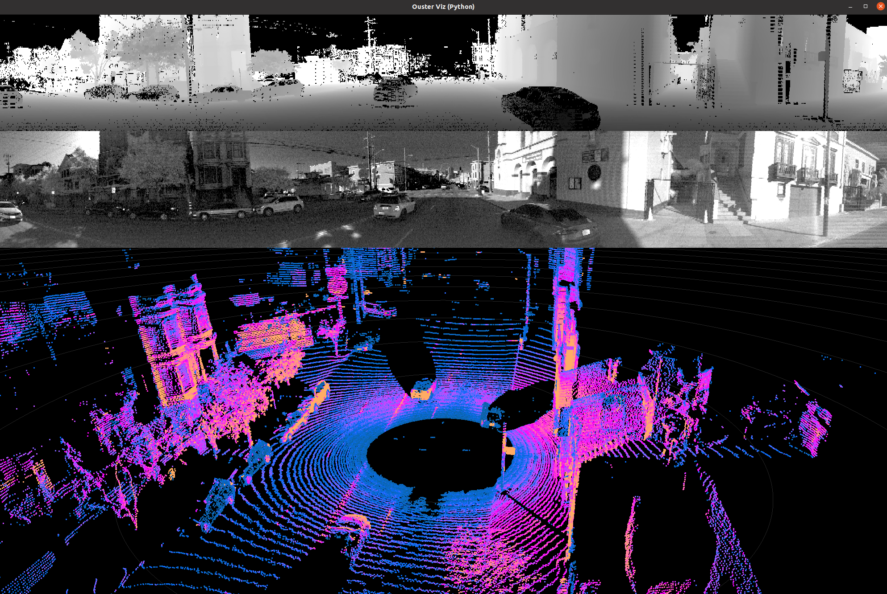

.. _installation:

============
Installation
============

The Ouster Python SDK requires Python >= 3.6 and pip >= 19.0. 

Using a virtual environment with the Ouster Python SDK is recommended. Users newer to Python should
read the official `venv instructions`_ and ensure that they upgrade pip *after* activating their
venv. If you're using venv on Windows, you'll want to use ``python`` and ``pip`` instead of ``py
-3`` and ``py -3 -m pip`` in the following Powershell snippets.

To install on :ref:`supported platforms<supported platforms>`, please upgrade your pip:

.. tabs::

    .. code-tab:: console Linux/macOS

        $ python3 -m pip install --upgrade pip 

    .. code-tab:: powershell Windows x64
        
        PS > py -3 -m pip install --upgrade pip

.. note::
    
    Apple M1 users should be aware that due to numpy support limitations they will need to use Python
    >=3.8.

Now that your Python environment has an up-to-date pip, you can install ouster-sdk:

.. tabs::

    .. code-tab:: console Linux/macOS

        $ python3 -m pip install 'ouster-sdk[examples]'

    .. code-tab:: powershell Windows x64

        PS > py -3 -m pip install 'ouster-sdk[examples]'

.. note::
    
    While the optional examples component is not required for ouster-sdk, we recommend installing it
    so you can run the various examples and Ouster's PyViz Visualizer, which will enable you to
    easily confirm a successful installation visually on recorded data, as outlined below.
 

To check that you've successfully installed the latest version of the Ouster Python SDK, run the
following command and make sure that the ``ouster-sdk`` package is included in the output:

.. tabs::

    .. code-tab:: console Linux/macOS

        $ python3 -m pip list

    .. code-tab:: powershell Windows x64

        PS > py -3 -m pip list

.. _venv instructions: https://packaging.python.org/guides/installing-using-pip-and-virtual-environments/#creating-a-virtual-environment

You should see something like:

.. parsed-literal::

        ouster-sdk                    \ |release|\

Confirming your installation
============================

Let's check quickly that everything in the installation is in order by visualizing sample data using
the Ouster PyViz Visualizer.

.. _sample-data-download:

Download Recorded Sample Data
-----------------------------

Download one of the following samples of recorded Ouster data and unzip the contents:

.. _dual-returns-snippets:

   * `OS0 128 Rev 06 Urban Drive (Dual Returns)`_ [176 MB]
   * `OS1 128 Rev 06 Urban Drive (Dual Returns)`_ [184 MB]
   * `OS2 128 Rev 06 Urban Drive (Dual Returns)`_ [194 MB]
   * `OS1 128 Rev 05 Urban Drive`_ [218 MB]
   * `OS2 128 Rev 05 Bridge`_ [82 MB]

.. _OS0 128 Rev 06 Urban Drive (Dual Returns): https://data.ouster.io/sdk-samples/Rev-06/OS0-128_Rev-06_Urban-Drive_Dual-Returns/OS0-128_Rev-06_Urban-Drive_Dual-Returns.zip
.. _OS1 128 Rev 06 Urban Drive (Dual Returns): https://data.ouster.io/sdk-samples/Rev-06/OS1-128_Rev-06_Urban-Drive_Dual-Returns/OS1-128_Rev-06_Urban-Drive_Dual-Returns.zip
.. _OS2 128 Rev 06 Urban Drive (Dual Returns): https://data.ouster.io/sdk-samples/Rev-06/OS2-128_Rev-06-Urban-Drive_Dual-Returns/OS2-128_Rev-06_Urban-Drive_Dual-Returns.zip
.. _OS1 128 Rev 05 Urban Drive: https://data.ouster.io/sdk-samples/Rev-05/OS1-128_Rev-05_Urban-Drive/OS1-128_Rev-05_Urban-Drive.zip
.. _OS2 128 Rev 05 Bridge: https://data.ouster.io/sdk-samples/Rev-05/OS2-128_Rev-05_Bridge/OS2-128_Rev-05_Bridge.zip 

In your unzipped directory, you should have two files, one ``.pcap`` file and one ``.json`` file.
For example, in the unzipped recorded sample of OS1-128 Rev 06 data you should find:

  * ``OS1-128_Rev-06_Urban-Drive_Dual-Returns.pcap``
  * ``OS2-128_Rev-06_Urban-Drive_Dual-Returns.json``

We will use ``SAMPLE_DATA_PCAP_PATH`` to refer to this pcap and ``SAMPLE_DATA_JSON_PATH`` to this
json in the following.  You may find it convenient to assign the paths appropriately in your console.

Visualize it
------------

After obtaining the recorded data, you can visualize it with the following command, substituting 

.. tabs::

    .. code-tab:: console Linux/macOS
        
        $ python3 -m ouster.sdk.examples.viz --pcap $SAMPLE_DATA_PCAP_PATH --meta $SAMPLE_DATA_JSON_PATH

    .. code-tab:: powershell Windows x64
        
        $ py -3 -m ouster.sdk.examples.open3d --pcap $SAMPLE_DATA_PCAP_PATH --meta $SAMPLE_DATA_JSON_PATH
       
You should get a view similar to:

    Ouster PyViz visualization of OS1 Rev 05 sample data

Congrats! You've installed and visualized with the Ouster Python SDK!

Next Steps
==========

To get a feel for working with the Ouster Sensor Python API, click next to proceed to the :doc:`quickstart`.

For shortcuts and controls for the Ouster PyViz Visualizer, or to immediately visualize data
directly from an Ouster sensor, see :ref:`ex-ouster-viz`.
