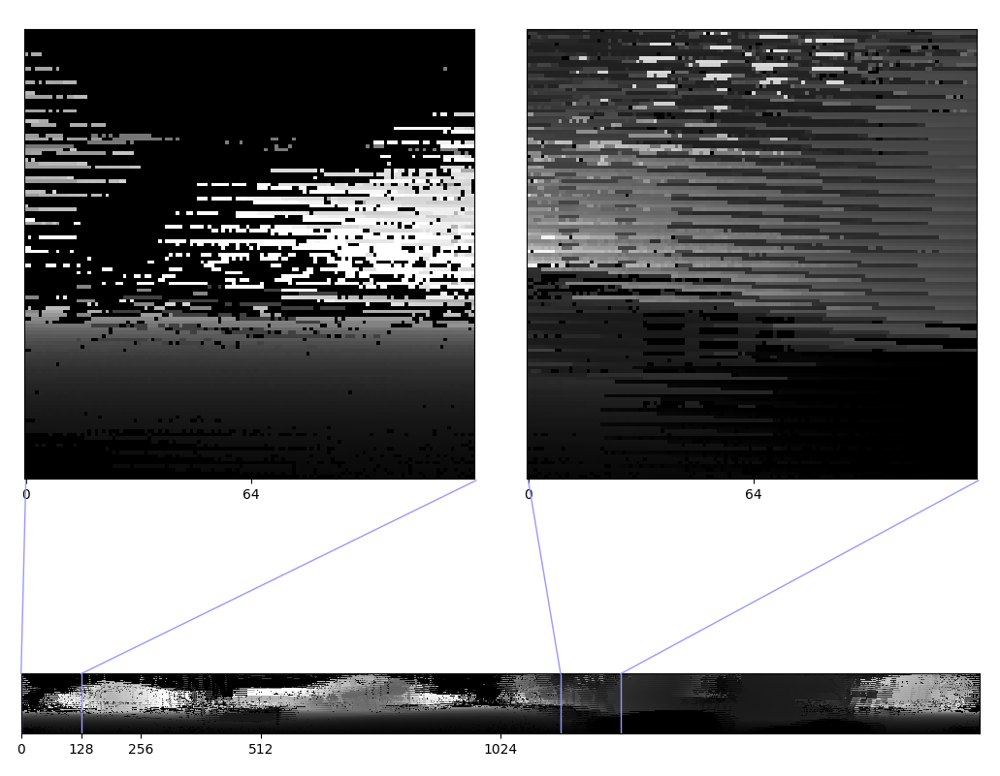
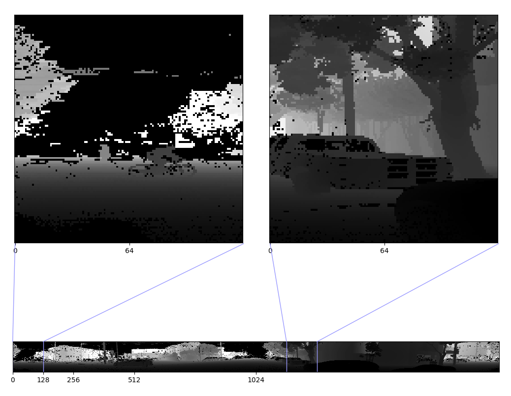
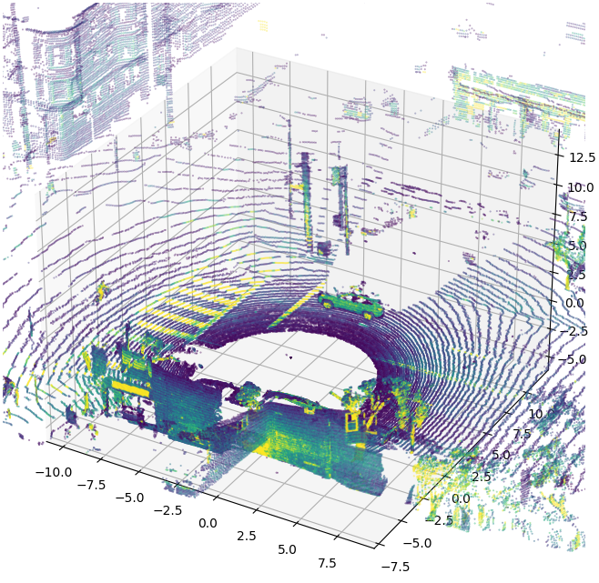
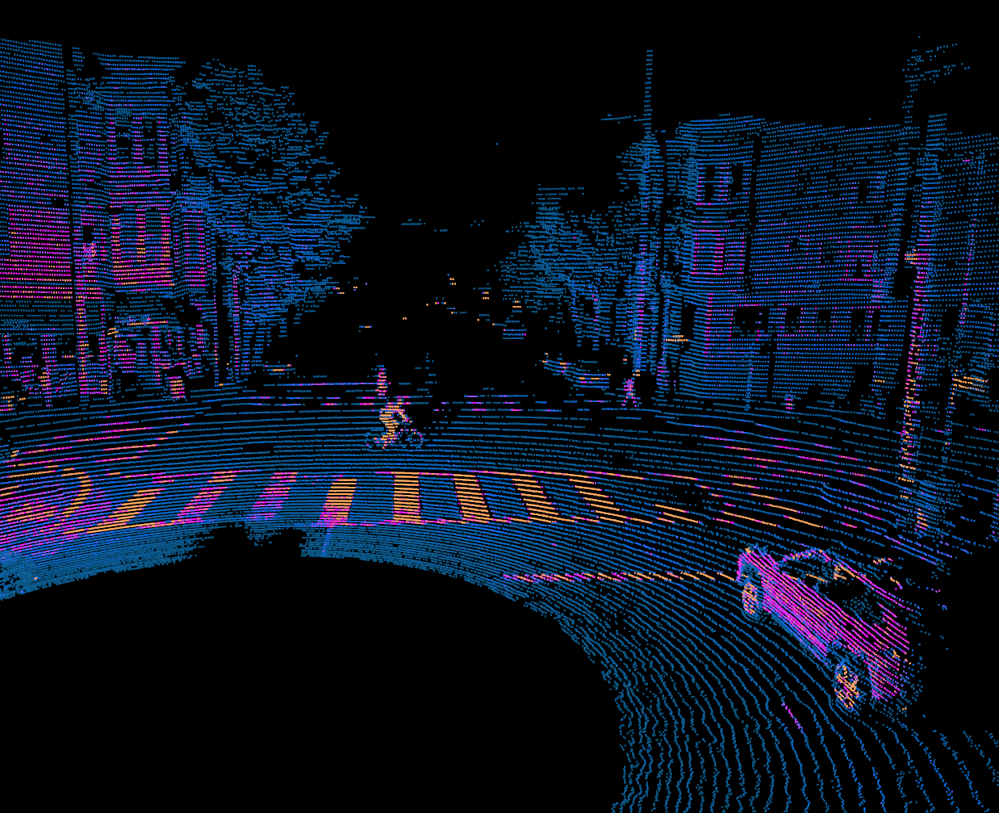

===================
Examples & Concepts
===================

A loosely connected collection of examples and concepts useful for working with Ouster SDK. If you
are just starting, please see :ref:`quickstart`.

For convenience, throughout the examples and concepts we will use ``pcap_path`` and
``metadata_path`` to refer to the path to a Ouster pcap and metadata file.  The pictures below are
taken from the `OS1 sample data`_.

.. _OS1 sample data: https://data.ouster.io/sdk-samples/OS1/OS1_128_sample.zip

.. _ex-metadata:

Obtaining Sensor Metadata
=========================

Ouster sensors require metadata to interpret the readings of the sensor. Represented by the object
:py:class:`.SensorInfo`, its fields include configuration parameters such as ``lidar_mode`` and
sensor intrinsics like ``beam_azimuth_angles``.

When you work with a sensor, the client will automatically fetch the metadata. Recorded
``pcaps``, however, must always be accompanied by a ``json`` file containing the metadata of the
sensor as it was running when the data was recorded.

Since it's crucial to save the correct metadata file, let's see how we can get that from a sensor.
Try running the following example:

.. tabs::

    .. code-tab:: console Linux/macOS x64

        $ python3 -m ouster.sdk.examples.client $SENSOR_HOSTNAME fetch-metadata

    .. code-tab:: console macOS M1

        $ arch --x86_64 python3 -m ouster.sdk.examples.client $SENSOR_HOSTNAME fetch-metadata

    .. code-tab:: powershell Windows x64

        PS > py -3 -m ouster.sdk.examples.client $SENSOR_HOSTNAME fetch-metadata

And now let's look inside the example we just ran:

.. literalinclude:: /../src/ouster/sdk/examples/client.py
    :start-after: [doc-stag-fetch-metadata]
    :end-before: [doc-etag-fetch-metadata]
    :dedent:

Seems simple enough!

.. _ex-packets:

Working Directly with Packets
=============================

The :py:class:`.PacketSource` is the basic interface for packets from the sensor. It can be
advantageous to work with packets directly when latency is a concern, or when you wish to examine
the data packet by packet, for example, if you wish to examine timestamps of packets.

Let's make a :py:class:`.PacketSource` from our sample data using :py:class:`.pcap.Pcap`:

.. code:: python

    with open(metadata_path, 'r') as f:
        metadata = client.SensorInfo(f.read())

    source = pcap.Pcap(pcap_path, metadata)

Now we can read packets from ``source`` with the following code:

.. literalinclude:: /../src/ouster/sdk/examples/pcap.py
    :start-after: [doc-stag-pcap-read-packets]
    :end-before: [doc-etag-pcap-read-packets]
    :dedent:

.. _ex-staggered-and-destaggered:

Staggered vs Destaggered 2D Representations
===========================================

The default **staggered** representation of a :py:class:`.LidarScan` has columns which pertain to
measurements taken at a single timestamp. For a more natural 2D image, we **destagger** the field
with the :py:func:`.client.destagger` function.

Let's take a look at a typical **staggered** representation:

   LidarScan ``RANGE`` field visualized with :py:func:`matplotlib.pyplot.imshow()` and simple gray
   color mapping for better look.

This **staggered** representation definitely doesn't look like a normal image, which shouldn't
surprise us since its columns pertain to timestamps instead of azimuth angles.

Let's destagger the image, changing the columns to represent the azimuth angles:

.. code:: python

    import matplotlib.pyplot as plt
    from more_itertools import nth

    # ... `metadata` and `source` variables created as in the previous examples

    scans = client.Scans(source)

    # iterate `scans` and get the 84th LidarScan
    scan = nth(scans, 84)
    ranges = scan.field(client.ChanField.RANGE)

    # destagger ranges, notice `metadata` use, that is needed to get
    # sensor intrinsics and correctly data transforms
    ranges_destaggered = client.destagger(source.metadata, ranges)

    plt.imshow(ranges_destaggered, cmap='gray', resample=False)

This should give the scene below, of which we have magnified two patches for better visiblity.

    **destaggered** LidarScan ``RANGE`` field

After destaggering, we can see the scene contains a man on a bicycle, a few cars, and many trees.
This image now makes visual sense, and we can easily use this data in common visual task pipelines.

.. note::

    By the way, you can view this particular scene in both 2D and 3D at Ouster's `Web Slam`_! Use
    your mouse to click and move the 3D scene, and the listed controls to rotate between different
    destaggered image views. The video at the bottom shows the registered point clouds of our
    internal SLAM algorithm.

.. _Web Slam: https://webslam.ouster.dev/slam/1610482355.9361048.rVdW_dgws/

.. _ex-xyzlut:

Projecting into Cartesian Coordinates
=====================================

To facilitate working with 3D points, you can call :py:func:`.client.XYZLut` to create a function
which will project a :py:class:`.LidarScan` into Cartesian coordinates using a precomputed lookup
table. The result of calling this function will be a point cloud represented as a numpy array. See
the API documentation for :py:func:`.client.XYZLut` for more details.

.. literalinclude:: /../src/ouster/sdk/examples/client.py
    :start-after: [doc-stag-plot-xyz-points]
    :end-before: [doc-etag-plot-xyz-points]
    :emphasize-lines: 2-3
    :linenos:
    :dedent:

If you have a sensor, you can run this code with one of our examples:

.. tabs::

    .. code-tab:: console Linux/macOS x64

        $ python3 -m ouster.sdk.examples.client $SENSOR_HOSTNAME plot-xyz-points

    .. code-tab:: console macOS M1

        $ arch --x86_64 python3 -m ouster.sdk.examples.client $SENSOR_HOSTNAME plot-xyz-points

    .. code-tab:: powershell Windows x64

        PS > py -3 -m ouster.sdk.examples.client $SENSOR_HOSTNAME plot-xyz-points

That should open a 3D plot of a single scan of your location taken just now by your sensor. You
should be able to recognize the contours of the scene around you.

If you don’t have a sensor, you can run this code with our pcap examples:

.. tabs::

    .. code-tab:: console Linux/macOS x64

        $ python3 -m ouster.sdk.examples.pcap OS1_128.pcap OS1_2048x10_128.json plot-xyz-points --scan-num 84

    .. code-tab:: console macOS M1

        $ arch --x86_64 python3 -m ouster.sdk.examples.pcap OS1_128.pcap OS1_2048x10_128.json plot-xyz-points --scan-num 84

    .. code-tab:: powershell Windows x64

        PS > python3 -m ouster.sdk.examples.pcap OS1_128.pcap OS1_2048x10_128.json plot-xyz-points --scan-num 84

   Point cloud from OS1 sample data (scan 84). Points colored by ``SIGNAL`` value.

For details check the source code of an example :func:`.examples.pcap.pcap_display_xyz_points`

Also check out a more powerful way of visualizing ``xyz`` 3d points with :ref:`ex-open3d`

.. _ex-correlating-2d-and-3d:

Working with 2D and 3D Representations Simultaneously
=====================================================

The direct correlation between 2D and 3D representations in an Ouster sensor provides a powerful
framework for working with the data. As an easy example, you might decide you want to look at only
the 3D points within a certain range and from certain azimuth angles.

.. literalinclude:: /../src/ouster/sdk/examples/client.py
    :start-after: [doc-stag-filter-3d]
    :end-before: [doc-etag-filter-3d]
    :emphasize-lines:  10-11, 15
    :linenos:
    :dedent:

Since we'd like to filter on azimuth angles, first we first destagger both the 2D and 3D points, so
that our columns in the ``HxW`` representation correspond to azimuth angle, not timestamp. (See
:ref:`ex-staggered-and-destaggered` for an explanation on destaggering.)

Then we filter the 3D points ``xyz_destaggered`` by comparing the range measurement to
``min_range``, which we can do because there is a 1:1 correspondence between the columns and rows of
the destaggered representations of ``xyz_destaggered`` and ``range_staggered``. (Similarly, there
would be a 1:1 correspondence between the staggered representations ``xyz`` and ``range``, where the
columns correspond with timestamp).

Finally, we select only the azimuth columns we're interested in. In this case, we've arbitrarily
chosen the first 270 degrees of rotation.

If you have a sensor, you can run this code with an example:

.. tabs::

    .. code-tab:: console Linux/macOS x64

        $ python3 -m ouster.sdk.examples.client $SENSOR_HOSTNAME filter-3d-by-range-and-azimuth

    .. code-tab:: console macOS M1

        $ arch --x86_64 python3 -m ouster.sdk.examples.client $SENSOR_HOSTNAME filter-3d-by-range-and-azimuth

    .. code-tab:: powershell Windows x64

        PS > python3 -m ouster.sdk.examples.client $SENSOR_HOSTNAME filter-3d-by-range-and-azimuth

.. _ex-streaming:

Streaming Live Data
===================

Instead of working with a recorded dataset or a few captured frames of data, let's see if we can get
a live feed from the sensor:

.. tabs::

    .. code-tab:: console Linux/macOS x64

        $ python3 -m ouster.sdk.examples.client $SENSOR_HOSTNAME live-plot-signal

    .. code-tab:: console macOS M1

        $ arch --x86_64 python3 -m ouster.sdk.examples.client $SENSOR_HOSTNAME live-plot-signal

    .. code-tab:: powershell Windows x64

        PS > py -3 -m ouster.sdk.examples.client $SENSOR_HOSTNAME live-plot-signal

This should give you a live feed from your sensor that looks like a black and white moving image.
Try waving your hand or moving around to find yourself within the image!

So how did we do that?

.. literalinclude:: /../src/ouster/sdk/examples/client.py
   :start-after: [doc-stag-live-plot-signal]
   :end-before: [doc-etag-live-plot-signal]
   :emphasize-lines: 2-3
   :linenos:
   :dedent:

Notice that instead of taking a ``sample`` as we did in previous example, we used
:py:meth:`.Scans.stream`, which allows for a continuous live data stream.  We close the ``stream``
when we are finished, hence the use of :py:func:`.closing` in the highlighted line.

To exit the visualization, you can use ``ESC``.

.. _ex-pcap-record:

Recording Sensor Data
=====================

It's easy to record data to a pcap file from a sensor programatically. Let's try it first
with the following example:

.. tabs::

    .. code-tab:: console Linux/macOS x64

        $ python3 -m ouster.sdk.examples.client $SENSOR_HOSTNAME record-pcap

    .. code-tab:: console macOS M1

        $ arch --x86_64 python3 -m ouster.sdk.examples.client $SENSOR_HOSTNAME record-pcap

    .. code-tab:: powershell Windows x64

        PS >  py -3 -m ouster.sdk.examples.client $SENSOR_HOSTNAME record-pcap

This will capture the :class:`.client.LidarPacket`'s and :class:`.client.ImuPacket`'s data for 10
seconds and store the pcap file along with the metadata json file into the current directory.

The source code of an example below:

.. literalinclude:: /../src/ouster/sdk/examples/client.py
   :start-after: [doc-stag-pcap-record]
   :end-before: [doc-etag-pcap-record]
   :emphasize-lines: 15
   :linenos:
   :dedent:

Good! The resulting pcap and json files can be used with any examples in the :mod:`.examples.pcap`
module.

.. _ex-pcap-live-preview:

PCAP Live Data Preview
=======================

We can easily view the data that was recorded in the previous section. Based on an example from
:ref:`ex-streaming` above we have a pcap viewer with additional *stagger*/*destagger* handler on key
`D` and pause on `SPACE` key  (source code: :func:`.examples.pcap.pcap_2d_viewer`). To run it try
the following command:

.. tabs::

    .. code-tab:: console Linux/macOS x64

        $ python3 -m ouster.sdk.examples.pcap OS1_128.pcap OS1_2048x10_128.json 2d-viewer

    .. code-tab:: console macOS M1

        $ arch --x86_64 python3 -m ouster.sdk.examples.pcap OS1_128.pcap OS1_2048x10_128.json 2d-viewer

    .. code-tab:: powershell Windows x64

        PS > python3 -m ouster.sdk.examples.pcap OS1_128.pcap OS1_2048x10_128.json 2d-viewer

Or substitute example data with pcap and json that you just recorded.

.. _ex-pcap-to-csv:

Converting PCAPs to CSV
=======================

Sometimes we want to get a point cloud (``XYZ`` + other fields) as a ``CSV`` file for further
analysis with other tools.

To convert the first ``5`` scans of our sample data from a pcap file, you can try:

.. tabs::

    .. code-tab:: console Linux/macOS x64

        $ python3 -m ouster.sdk.examples.pcap OS1_128.pcap OS1_2048x10_128.json pcap-to-csv --scan-num 5

    .. code-tab:: console macOS M1

        $ arch --x86_64 python3 -m ouster.sdk.examples.pcap OS1_128.pcap OS1_2048x10_128.json pcap-to-csv --scan-num 5

    .. code-tab:: powershell Windows x64

        PS > py -3 -m ouster.sdk.examples.pcap OS1_128.pcap OS1_2048x10_128.json pcap-to-csv --scan-num 5

The source code of an example below:

.. literalinclude:: /../src/ouster/sdk/examples/pcap.py
    :start-after: [doc-stag-pcap-to-csv]
    :end-before: [doc-etag-pcap-to-csv]
    :emphasize-lines: 33-37
    :linenos:
    :dedent:

Because we stored the scan as structured 2D images, we can easily recover it by loading it back into
a ``numpy.ndarray`` and continuing to use it as a 2D image.

.. code:: python

    import numpy as np

    # read array from CSV
    frame = np.loadtxt('my_frame_00000.csv', delimiter=',')

    # convert back to "fat" 2D image [H x W x 7] shape
    frame = frame.reshape((128, -1, frame.shape[1]))

We used ``128`` while restoring 2D image from a CSV file because it's the number of channels of our
``OS-1-128.pcap`` sample data recording.

Check :func:`.examples.pcap.pcap_to_csv` documentation for further details.

.. _ex-open3d:

Visualization with Open3d
=========================

The `Open3d library`_ contains Python bindings for a variety of tools for working with point cloud
data. Loading data into Open3d is just a matter of reshaping the numpy representation of a point
cloud, as demonstrated in the :func:`.examples.pcap.pcap_3d_one_scan` example:

.. literalinclude:: /../src/ouster/sdk/examples/pcap.py
    :start-after: [doc-stag-open3d-one-scan]
    :end-before: [doc-etag-open3d-one-scan]
    :emphasize-lines: 1-6
    :linenos:
    :dedent:

The :mod:`.examples.open3d` module contains a more fully-featured visualizer built using the Open3d
library, which can be used to replay pcap files or visualize a running sensor. The bulk of the
visualizer is implemented in the :func:`.examples.open3d.viewer_3d` function.

.. note::

   You'll have to install the `Open3d package`_ from PyPI to run this example. Note that as of
   version ``0.13.0``, binaries are not yet provided for Python 3.9 or ARM systems.

As an example, you can view frame ``84`` from the sample data by running the following command:

.. tabs::

    .. code-tab:: console Linux/macOS x64

       $ python3 -m ouster.sdk.examples.open3d \
           --pcap OS1_128.pcap --meta OS1_2048x10_128.json --start 84 --pause

    .. code-tab:: console macOS M1

       $ arch --x86_64 python3 -m ouster.sdk.examples.open3d \
           --pcap OS1_128.pcap --meta OS1_2048x10_128.json --start 84 --pause

    .. code-tab:: powershell Windows x64

       PS > py -3 -m ouster.sdk.examples.open3d ^
           --pcap OS1_128.pcap --meta OS1_2048x10_128.json --start 84 --pause

You may also want to try the ``--sensor`` option to display the output of a running sensor. Use the
``-h`` flag to see a full list of command line options and flags.

Running the example above should open a window displaying a scene from a city intersection,
reproduced below:

   Open3D visualization of OS1 sample data (frame 84). Points colored by ``SIGNAL`` field.

You should be able to click and drag the mouse to look around. You can zoom in and out using the
mouse wheel, and hold control or shift while dragging to pan and roll, respectively.

Hitting the spacebar will start playing back the rest of the pcap in real time. Note that reasonable
performance for realtime playback requires relatively fast hardware, since Open3d runs all rendering
and processing in a single thread.

All of the visualizer controls are listed in the table below:

.. list-table:: Open3d Visualizer Controls
   :widths: 15 30
   :header-rows: 1
   :align: center

   * - Key
     - What it does
   * - **Mouse wheel**
     - Zoom in an out
   * - **Left click + drag**
     - Tilt and rotate the camera
   * - **Ctrl + left click + drag**
     - Pan the camera laterally
   * - **Shift + left click + drag**
     - Roll the camera
   * - **"+" / "-"**
     - Increase or decrease point sizes
   * - **Spacebar**
     - Pause or resume playback
   * - **"M"**
     - Cycle through channel fields used for visualization
   * - **Right arrow key**
     - When reading a pcap, jump 10 frames forward

.. _Open3d library: http://www.open3d.org/
.. _Open3d package: https://pypi.org/project/open3d/

.. _ex-imu:

Working with IMU data from the Ouster Sensor
============================================

IMU data from the Ouster sensor can be read as :py:class:`~.client.ImuPacket`. Let's do something
easy, like graph the acceleration in z direction over time. Let's look at some code:

.. literalinclude:: /../src/ouster/sdk/examples/client.py
    :start-after: [doc-stag-imu-z-accel]
    :end-before: [doc-etag-imu-z-accel]
    :emphasize-lines: 4-6
    :linenos:

Like other ``Packets``, we'll want to get them from a :py:class:`.PacketSource`. After getting
``imu_packet_list``, we obtain the ``sys_ts`` and ``z`` part of ``accel`` and plot them.

If you have a sensor, you can run the code above with the ``plot-imu-z-accel`` example:

.. tabs::

    .. code-tab:: console Linux/macOS x64

       $ python3 -m ouster.sdk.examples.client $SENSOR_HOSTNAME plot-imu-z-accel

    .. code-tab:: console macOS M1

       $ arch --x86_64 python3 -m ouster.sdk.examples.client $SENSOR_HOSTNAME plot-imu-z-accel

    .. code-tab:: powershell Windows x64

       PS > py -3 -m ouster.sdk.examples.client $SENSOR_HOSTNAME plot-imu-z-accel
