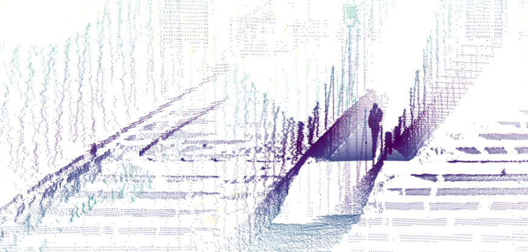

.. _quickstart:

==================================
Quick Start with Ouster Python SDK
==================================

This quickstart guide will walk you through visualizing Ouster sensor data quickly, whether from
sample data or a sensor connected to your machine.

Installation
============

The Ouster Python SDK requires Python >= 3.6 and pip >= 19.0. To install on :ref:`supported platforms<supported platforms>`, run:

.. tabs::

    .. code-tab:: console Linux/macOS x64

        $ python3 -m pip install 'ouster-sdk[examples]'

    .. code-tab:: console macOS M1

        $ arch --x86_64 python3 -m pip install 'ouster-sdk[examples]'

    .. code-tab:: powershell Windows x64

        PS > py -3 -m pip install 'ouster-sdk[examples]'

.. note::

   **Using a virtual environment** is recommended. Users newer to Python should read the official
   `venv instructions`_ and ensure that they have `upgraded pip`_ once their venv is activated. If
   you're using venv on Windows, you'll want to use ``python`` and ``pip`` instead of ``py -3`` and
   ``py -3 -m pip`` in the following Powershell snippets.

   **Apple M1 users** should be aware that they will need to prepend all python3 commands with
   ``arch --x86_64`` when working with ouster-sdk to force macOS to run the intel versions of python
   as numpy support on native M1 has not arrived yet.

To check that you've successfully installed the latest version of the Ouster Python SDK, run the
following command and make sure that the ``ouster-sdk`` package is included in the output:

.. tabs::

    .. code-tab:: console Linux/macOS x64

        $ python3 -m pip list

    .. code-tab:: console macOS M1

        $ arch --x86_64 python3 -m pip list

    .. code-tab:: powershell Windows x64

        PS > py -3 -m pip list

.. _upgraded pip: https://pip.pypa.io/en/stable/installing/#upgrading-pip
.. _venv instructions: https://packaging.python.org/guides/installing-using-pip-and-virtual-environments/#creating-a-virtual-environment

Using this Guide
================

You'll want to start an interactive Python session and keep it open through the sections, as we'll
be reusing variables created in earlier parts while explaining what we're doing as we go.

To get started, open a new console/Powershell window and start a python interpreter:

.. tabs::

    .. code-tab:: console Linux/macOS x64

        $ python3

    .. code-tab:: console macOS M1

        $ arch --x86_64 python3

    .. code-tab:: powershell Windows x64

        PS > py -3

Throughout this guide we will indicate console commands with ``$`` and python interpreter commands
with ``>>>``, just as we have above.

If you'd like to start by working with sample data, continue to the next section. If you'd prefer to
start capturing data from a sensor, you can skip to `Using an Ouster Sensor`_ below.

Using Sample Data
=================

Download the `OS2 bridge sample data`_ (**80 MB**) and unzip the contents. To use subsequent code
snippets as-is you should extract this file into the same directory from which you're running your
Python interpreter. You should have two files:

  * ``OS2_128_bridge_sample.pcap``
  * ``OS2_2048x10_128.json``

The downloaded pcap file contains lidar and imu packets captured from the network. You can read
more about the `IMU Data Format`_ and `Lidar Data Format`_ in the Ouster Sensor Documentation. The
JSON file contains metadata queried from the sensor TCP interface necessary for interpreting
the packet data.

.. code:: python

   >>> pcap_path = 'OS2_128_bridge_sample.pcap'
   >>> metadata_path = 'OS2_2048x10_128.json'

You may have do adjust these paths to the directory where the unzipped ``pcap`` and ``json`` file
are located. Because our pcap file contains the UDP packet stream but not the sensor metadata, we
load the metadata from ``metadata_path`` first, using the client module:

.. code:: python

   >>> from ouster import client
   >>> with open(metadata_path, 'r') as f:
   ...     metadata = client.SensorInfo(f.read())

Now that we've parsed the metadata file into a :py:class:`.SensorInfo`, we can use it to read our
captured UDP data by instantiating :py:class:`.pcap.Pcap`. This class acts as a
:py:class:`.PacketSource` and can be used in many of the same contexts as a real sensor.

.. code:: python

    >>> from ouster import pcap
    >>> source = pcap.Pcap(pcap_path, metadata)

To visualize data from this pcap file, proceed to `Visualizing Lidar Data`_ below.

.. _OS2 bridge sample data: https://data.ouster.io/sdk-samples/OS2/OS2_128_bridge_sample.zip
.. _Lidar Data Format: https://data.ouster.io/downloads/software-user-manual/software-user-manual-v2p0.pdf#10
.. _IMU Data Format: https://data.ouster.io/downloads/software-user-manual/software-user-manual-v2p0.pdf#13

Using an Ouster Sensor
======================

If you have access to sensor hardware, you can start reading data by instantiating a
:py:class:`.PacketSource` that listens for a UDP data stream on a local socket.

.. note::

   Connecting to an Ouster sensor is covered in the `Networking Guide`_ section of the Ouster
   Sensor Documentation.

In the following, ``<SENSOR_HOSTNAME>`` should be substituted for the actual hostname or IP of your
sensor.

To make sure everything is connected, open a separate console window and try pinging the sensor. You
should see some output like:

.. tabs::

    .. code-tab:: console Linux/macOS x64

       $ ping -c1 <SENSOR_HOSTNAME>
       PING <SENSOR_HOSTNAME> (192.0.2.42) 56(84) bytes of data.
       64 bytes from <SENSOR_HOSTNAME> (192.0.2.42): icmp_seq=1 ttl=64 time=0.217 ms

    .. code-tab:: console macOS M1

       $ ping -c1 <SENSOR_HOSTNAME>
       PING <SENSOR_HOSTNAME> (192.0.2.42) 56(84) bytes of data.
       64 bytes from <SENSOR_HOSTNAME> (192.0.2.42): icmp_seq=1 ttl=64 time=0.217 ms

    .. code-tab:: powershell Windows x64

       PS > ping /n 10 <SENSOR_HOSTNAME>
       Pinging <SENSOR_HOSTNAME> (192.0.2.42) with 32 bytes of data:
       Reply from 192.0.2.42: bytes=32 time=101ms TTL=124

Next, you'll need to configure the sensor with the config parameters using the client module. In
your open python session:

.. code:: python

   >>> hostname = '<SENSOR_HOSTNAME>'
   >>> from ouster import client
   >>> config = client.SensorConfig()
   >>> config.udp_port_lidar = 7502
   >>> config.udp_port_imu = 7503
   >>> config.operating_mode = client.OperatingMode.OPERATING_NORMAL
   >>> client.set_config(hostname, config, persist=True, udp_dest_auto = True)

Just like with the sample data, you can create a :py:class:`.PacketSource` from the sensor:

.. code:: python

   >>> source = client.Sensor(hostname)

Now we have a ``source`` from our sensor! To visualize data from your sensor, proceed to
`Visualizing Lidar Data`_ directly below.

.. _Networking Guide: https://data.ouster.io/downloads/software-user-manual/software-user-manual-v2p0.pdf#64

Visualizing Lidar Data
======================

At this point, you should have defined ``source`` using either a pcap file or UDP data streaming
directly from a sensor. Let's read from ``source`` until we get to the 50th frame of data:

.. code:: python

   >>> from contextlib import closing
   >>> from more_itertools import nth
   >>> with closing(client.Scans(source)) as scans:
   ...     scan = nth(scans, 50)

.. note::

    If you're using a sensor and it takes a few seconds, don't be alarmed! It has to get to the 50th
    frame of data, which would be 5.0 seconds for a sensor running in 1024x10 mode.

Now that we have a frame of data available as a :py:class:`.LidarScan` datatype, we can extract the
range measurements and turn them into a range image where each column corresponds to a single
azimuth angle:

.. code:: python

   >>> range_field = scan.field(client.ChanField.RANGE)
   >>> range_img = client.destagger(source.metadata, range_field)

We can plot the results using standard Python tools that work with numpy datatypes. Here, we extract
a column segment of the range data and display the result:

.. code:: python

   >>> import matplotlib.pyplot as plt
   >>> plt.imshow(range_img[:, 640:1024], resample=False)
   >>> plt.axis('off')
   >>> plt.show()

.. note::

    If running ``plt.show`` gives you an error about your Matplotlib backend, you will need a `GUI
    backend`_ such as TkAgg or Qt5Agg in order to visualize your data with matplotlib.

    Range image of OS2 sample data. Data taken at Brooklyn Bridge, NYC.

In addition to viewing the data in 2D, we can also plot the results in 3D by projecting the range
measurements into Cartesian coordinates. To do this, we first create a lookup table, then use it to
produce X, Y, Z coordinates from our scan data with shape (H x W x 3):

.. code:: python

    >>> xyzlut = client.XYZLut(source.metadata)
    >>> xyz = xyzlut(scan)

Now we rearrange the resulting numpy array into a shape that's suitable for plotting:

.. code:: python

    >>> import numpy as np
    >>> [x, y, z] = [c.flatten() for c in np.dsplit(xyz, 3)]
    >>> ax = plt.axes(projection='3d')
    >>> r = 10
    >>> ax.set_xlim3d([-r, r])
    >>> ax.set_ylim3d([-r, r])
    >>> ax.set_zlim3d([-r/2, r/2])
    >>> plt.axis('off')
    >>> z_col = np.minimum(np.absolute(z), 5)
    >>> ax.scatter(x, y, z, c=z_col, s=0.2)
    >>> plt.show()

You should be able to rotate the resulting scene to view it from different angles.

To learn more about manipulating lidar data, see :ref:`ex-staggered-and-destaggered`,
:ref:`ex-xyzlut` and :ref:`ex-correlating-2d-and-3d`.

   Point cloud from OS2 sample data with colormap on z. Data taken at Brooklyn Bridge, NYC.

.. _GUI backend: https://matplotlib.org/stable/tutorials/introductory/usage.html#the-builtin-backends

Next Steps
==========

You have now officially visualized Ouster lidar in both 2D and 3D data using the Ouster Python SDK!
Now that you know the basics, you can check out our annotated examples for a more detailed look at
how to work with our data.

Here are a few things you might be interested in:

    * :ref:`ex-metadata`
    * :ref:`ex-packets`
    * :ref:`ex-streaming`
    * :ref:`ex-pcap-record`
    * :ref:`ex-staggered-and-destaggered`
    * :ref:`ex-xyzlut`
    * :ref:`ex-correlating-2d-and-3d`
    * :ref:`ex-pcap-to-csv`
    * :ref:`ex-open3d`
    * :ref:`ex-imu`
