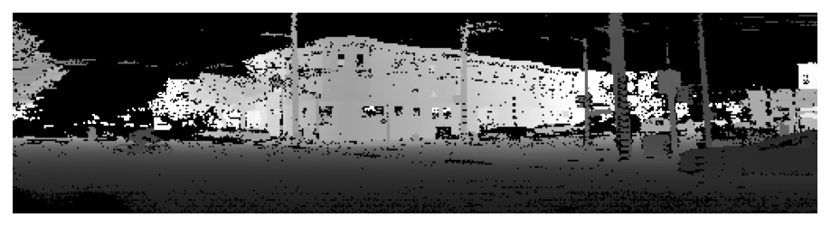
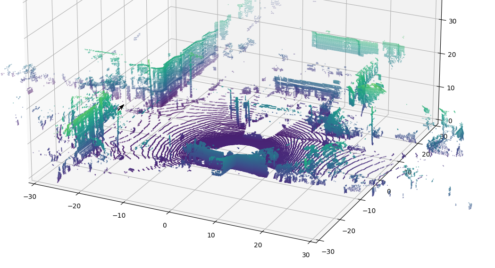

.. _quickstart:

==================================
Quick Start with Ouster Python SDK
==================================

This quickstart guide will walk you through visualizing Ouster sensor data quickly, whether from
sample data or a sensor connected to your machine.

Installation
============

The Ouster Python SDK requires Python >= 3.6 and pip >= 19.0. To install on `supported platforms`_, run::

    $ python3 -m pip install ouster-sdk[examples]

.. note::

   Newer users to Python should create a suitable `venv`_, `activate`_ it, and ensure that they have
   `upgraded pip`_ once their venv is activated.

To check that you've succesfully installed the latest version of the Ouster Python SDK, run::
    
    $ pip list

.. note::

   To run the example code on Windows 10, you may also find that you need the ``PyQt5`` library.

.. _supported platforms: https://static.ouster.dev/sdk-docs/index.html#installation
.. _upgraded pip: https://pip.pypa.io/en/stable/installing/#upgrading-pip
.. _venv: https://packaging.python.org/guides/installing-using-pip-and-virtual-environments/#creating-a-virtual-environment
.. _activate: https://packaging.python.org/guides/installing-using-pip-and-virtual-environments/#activating-a-virtual-environment

Using this Guide
================

You'll want to start an interactive Python session and keep it open through the sections, as we'll
be reusing variables created in earlier parts while explaining what we're doing as we go.

To get started, open a new terminal window and start a python interpreter::

    $ python3

In the python session that opens, import the Ouster Python Client:

.. code:: python
    
   >>> from ouster import client

Throughout this guide we will indicate console commands with ``$`` and python interpreter commands
with ``>>>``, just as we have above.

If you'd like to start by working with sample data, continue to the section below. If you'd prefer
to start capturing data from a sensor, you can skip to `Using an Ouster Sensor`_ below.

Using Sample Data
=================

Download the `sample data`_ (**1.6 GB**) and unzip the contents. You should have two files:

  * ``OS1_128.pcap``
  * ``OS1_2048x10_128.json``

The downloaded pcap file contains lidar and imu packets captured from the network . You can read
more about the `IMU Data Format`_ and `Lidar Data Format`_ in the Ouster Sensor Documentation. The
JSON file contains metadata queried from the sensor TCP interface necessary for interpreting
the packet data.

Let's load the paths into your open session of python:

.. code:: python

   >>> pcap_path = '/path/to/OS1_128.pcap'
   >>> metadata_path = '/path/to/OS1_2048x10_128.json'

Because our pcap file contains the UDP packet stream but not the sensor metadata, we load the
metadata from ``metadata_path`` first:

.. code:: python
 
   >>> with open(metadata_path, 'r') as f:
   ...     metadata = client.SensorInfo(f.read())

Now that we've parsed the metadata file into a :py:class:`.SensorInfo`, we can use it to read our
captured UDP data by instantiating :py:class:`.pcap.Pcap`. This class acts as a
:py:class:`.PacketSource` and can be used in many of the same contexts as a real sensor.

.. code:: python

    >>> from ouster import pcap
    >>> source = pcap.Pcap(pcap_path, metadata)

To visualize data from this pcap file, proceed to `Visualizing Lidar Data`_ below.

.. _sample data: https://data.ouster.io/sdk-samples/OS1/OS1_128_sample.zip
.. _Lidar Data Format: https://data.ouster.io/downloads/software-user-manual/software-user-manual-v2p0.pdf#10
.. _IMU Data Format: https://data.ouster.io/downloads/software-user-manual/software-user-manual-v2p0.pdf#13
.. _Ouster Sample Data: https://ouster.com/resources/lidar-sample-data/

Using an Ouster Sensor
======================

If you have access to sensor hardware, you can start reading data by instantiating a
:py:class:`.PacketSource` that listens for a UDP data stream on a local socket.

.. note::

   Connecting to an Ouster sensor is covered in the `Networking Guide`_ section of the Ouster
   Sensor Documentation.

In the following, ``<SENSOR_HOSTNAME>`` should be substituted for the actual hostname or IP of your
sensor and ``<UDP_DEST>`` should be the hostname or IP of the machine reading sensor data, per the
network configuration.

To make sure everything is connected, open a separate console window and try pinging the sensor. You
should see some output like::

   $ ping -c1 <SENSOR_HOSTNAME>
   PING <SENSOR_HOSTNAME> (192.0.2.42) 56(84) bytes of data.
   64 bytes from <SENSOR_HOSTNAME> (192.0.2.42): icmp_seq=1 ttl=64 time=0.217 ms

Next, you'll need to configure the sensor with the config parameters. In your open python session:

.. code:: python

   >>> hostname = '<SENSOR_HOSTNAME>'
   >>> config = client.SensorConfig()
   >>> config.udp_port_lidar = 7502
   >>> config.udp_port_imu = 7503
   >>> config.operating_mode = client.OperatingMode.OPERATING_NORMAL
   >>> client.set_config(hostname, config, persist=True, udp_dest_auto=True)

Just like with the sample data, you can create a :py:class:`.PacketSource` from the sensor:
    
.. code:: python

   >>> source = client.Sensor(hostname)

Now we have a ``source`` from our sensor! To visualize data from your sensor, proceed to
`Visualizing Lidar Data`_ directly below.

.. _Networking Guide: https://data.ouster.io/downloads/software-user-manual/software-user-manual-v2p0.pdf#64

Visualizing Lidar Data
======================

At this point, you should have defined ``source`` using either a pcap file or UDP data streaming
directly from a sensor. Let's read from ``source`` until we get to the 84th frame of data:

.. code:: python

   >>> from contextlib import closing
   >>> from more_itertools import nth
   >>> with closing(client.Scans(source)) as scans:
   ...     scan = nth(client.Scans(source), 84)
   >>> scan
   <ouster.client.data.LidarScan object at 0x7f7ccc35fba8>

.. note::

    If you're using a sensor and it takes a few seconds, don't be alarmed! It has to get to the 84th
    frame of data, which would be 8.4 seconds into recording for a sensor in 1024x10 mode.

Now that we have a frame of data available as a :py:class:`.LidarScan` datatype, we can extract the
range measurements and turn them into a range image where each column corresponds to a single
azimuth angle:

.. code:: python

   >>> range_field = scan.field(client.ChanField.RANGE)
   >>> range_img = client.destagger(source.metadata, range_field)

We can plot the results using standard Python tools that work with numpy datatypes. Here, we extract
the first 512 columns of range data and display the result:

.. code:: python

   >>> import matplotlib.pyplot as plt
   >>> plt.imshow(range_img[:, 0:512], cmap='gray', resample=False)
   >>> plt.axis('off')
   >>> plt.show()

.. note::
    
    If running ``plt.show`` gives you an error about your Matplotlib backend, you will need a `GUI
    backend`_ such as TkAgg or Qt5Agg in order to visualize your data with matplotlib.

   First 512 columns of LidarScan ``RANGE`` field of sample data with simple gray colormapping.

In addition to viewing the data in 2D, we can also plot the results in 3D by projecting the range
measurements into cartesian coordinates.  To do this, we first create a lookup table, then use it to
produce X, Y, Z coordinates from our scan data with shape (H x W x 3):

.. code:: python

    >>> xyzlut = client.XYZLut(source.metadata)
    >>> xyz = xyzlut(scan)

Now we rearrange the resulting numpy array into a shape that's suitable for plotting:

.. code:: python

    >>> import numpy as np
    >>> [x, y, z] = [c.flatten() for c in np.dsplit(xyz, 3)]
    >>> ax = plt.axes(projection='3d')
    >>> r = 30
    >>> ax.set_xlim3d([-r, r])
    >>> ax.set_ylim3d([-r, r])
    >>> ax.set_zlim3d([0, 2 * r])
    >>> ax.scatter(x, y, z, c=z / max(z), s=0.2)
    >>> plt.show()

To learn more about manipulating lidar data, see :ref:`ex-staggered-and-destaggered`, :ref:`ex-xyzlut` and :ref:`ex-correlating-2d-and-3d`.

   Point cloud from sample data. Points colored by Z coordinate value.

.. _GUI backend: https://matplotlib.org/stable/tutorials/introductory/usage.html#the-builtin-backends

Next Steps
==========

You have now officially visualized Ouster lidar in both 2D and 3D data using the Ouster Python SDK!
Now that you know the basics, you can check out our annotated examples for a more detailed look at
how to work with our data.

Here are a few things you might be interested in:

    * :ref:`ex-metadata`
    * :ref:`ex-packets`
    * :ref:`ex-streaming`
    * :ref:`ex-pcap-record`
    * :ref:`ex-staggered-and-destaggered`
    * :ref:`ex-xyzlut`
    * :ref:`ex-correlating-2d-and-3d`
    * :ref:`ex-pcap-to-csv`
    * :ref:`ex-imu`

